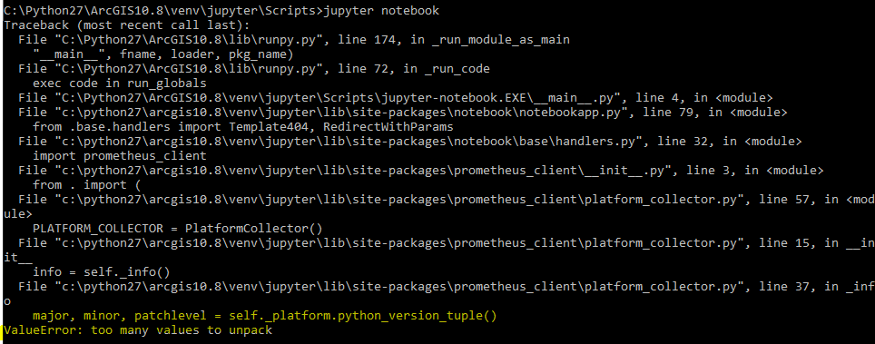
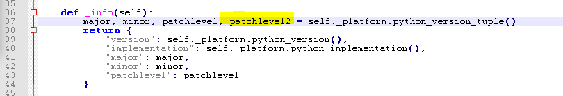
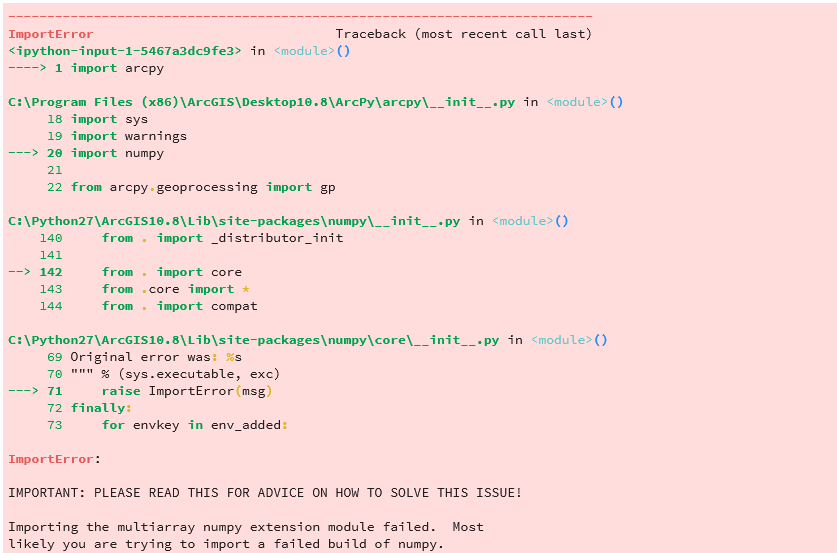

# How to setup Jupyter for Arcgis 10.x
(here ArcGIS 10.8 as example, change to actural version)
## 1. create a virtual environment as follow..
+ open cmd.exe as adminstrator
 + cd python27\arcgis10.8
 + python -m pip install virtualenv
 + python -m virtualenv venv\jupyter
 + cd venv\jupyter\scripts
 + python -m pip install pywinpty==0.5.1
 + python -m pip install jupyter
 + python -m pip install jupyterlab
 + install any module you want to install here

## 2. link to Arcpy and numpy modules

Although you have installed jupyter, you cannot import arcpy module yet. Do following steps

(ref: https:\\notesfromthelifeboat.com\post\arcpy-virtualenv\)

open command prompt (cmd.exe) as adminstrator
+ cd c:\Python27\ArcGIS10.8
+ mkdir arcpy_includes
+ cd arcpy_includes
+ from windows explorer goto c:\Python27\ArcGIS10.8\Lib\site-packages\
  - copy Desktop10.8.pth and
    - paste into c:\Python27\ArcGIS10.8\arcpy_includes 
    - panste into c:\Python27\ArcGIS10.8\venv\jupyter\Lib\site-packages 
+ in command propt, from acrpy_includes directory, type following commands and run
  - mklink/D numpy c:\Python27\ArcGIS10.8\Lib\site-packages\numpy 

## 3. Prepare for Jupyter lab
+ if not installed in step 1, install jupyter lab: _C:\Python27\ArcGIS10.8\venv\jupyter\Scripts\python -m pip install jupyterlab_ 
+ copy C:\Python27\ArcGIS10.8\venv\jupyter\Scripts\activate.bat as jupyterlab_activate.bat in the same folder
+ edit jupyterlab_activate.bat with notepad or notepad++
  + add _set "PYTHONPATH=C:\Python27\ArcGIS10.8\Lib\site-packages"_ at second line
 
  + ...

  + add _jupyter-lab.exe_ at the end of file
  + 
</img>

## 4. Create a widnows short cut for Jupyter lab
+ create a shortcut by right click over jupyterlab_activate.bat file and select shortcut to desktop
+ open properties of the _short cut_
  + add path for home folder for jupyter notebooks in _"Start in"_ e.g _D:\00_MyPy_scripts\jupyter_notebooks\AutoGIS
</img>  
  Now you double click the short cut and juputer lab will open

type __import arcpy__ in new cell of new notebook

if no error, you are ready for ArcGIS on Jupyter environment

## 5. Jupyter notebook or lab is not runing 
I got this error when I run jupyter

</img>

I finally fix this way.. ad extra variable in platform_collector.py (C:\Python27\ArcGIS10.8\venv\jupyter\Lib\site-packages\prometheus_client\platform_collector.py)

</img>
### 6. ArcPy import error in jupyter
You may get this error..
</img>

in that case put REM before set "PYTHONPATH=C:\Python27\ArcGIS10.8\Lib\site-packages" in jupyterlab_activate.bat file

and as recommended by **https:\\notesfromthelifeboat.com\post\arcpy-virtualenv\**

Create a file called **sitecustomize.py**, in C:/Python27/ArcGIS10.8/Lib (note that the documentation recommends placing sitecustomize.py in the global Lib/site-packages directory, but virtualenv won’t be able to find it there). 

The contents of the file are short:

<code>
import site

site.addsitedir('c:/Python27/ArcGIS10.5/arcpy_includes')
</code> 

## 7. installation of Geopandas.
It is a bit headache to install Geopandas from pip. use below whl files from ArcGIS10.8_whl folder or [download from Gohlek's repository](https://www.lfd.uci.edu/~gohlke/pythonlibs/) 
install in below order
pip install 
 - Shapely-1.6.4.post1-cp27-cp27m-win32.whl
 - pyproj-1.9.6-cp27-cp27m-win32.whl
 - gdal-2.2.4-cp27-cp27m-win32.whl
 - Fiona-1.8.13-cp27-cp27m-win32.whl
 - geopandas-0.4.0-py2.py3-none-any.whl

A list of moudles installed on my computer for ArcGIS10.8 env is also avalible in this repository
